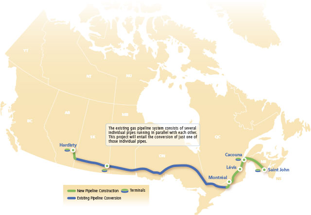

# Énergies fossiles

## Table des matières

* [L'oéloduc de TransCanada](#oleoduc-transcanada)
* [L'inversion de l'oléoduc 9B d'Enbridge](#oleoduc-enbridge)
* [Transport et transformation du pétrole](#transport-transformation-petrole)
* [Le pétrole d'Anticosti](#anticosti)
* [Les forages au Québec](#forages)

## <a name="oleoduc-transcanada">L'oéloduc de TransCanada</a>

<table>
  <tr>
    <th>Compagnie</th>
    <td><a href="http://en.wikipedia.org/wiki/TransCanada_Corp.">TransCanada Corporation</a></td>
  </tr>

  <tr>
    <th>Siège social</th>
    <td>Calgary, Alberta</td>
  </tr>

  <tr>
    <th>Nom du projet</th>
    <td><a href="http://www.oleoducenergieest.com">Oléoduc Énergie Est</a></td>
  </tr>
  <tr>
    <th>Débit</th>
    <td>1,1 million barils de pétrole par jour</td>
  </tr>
  <tr>
    <th>Numéro de projet à l'ONE</th>
    <td><a href="https://docs.neb-one.gc.ca/ll-eng/llisapi.dll?func=ll&objId=2540913&objAction=browse&viewType=1">2540913</a> (<a href="https://www.neb-one.gc.ca/pplctnflng/mjrpp/nrgyst/index-fra.html">page du projet</a>)</td>
  </tr>

</table>

* TransCanada projette de construire un oléoduc qui reliera l'Ouest canadien au Nouveau-Brunswick. ([source][3])
* L'oléoduc doit alimenter les deux raffineries du Québec. ([source][3])
* Le pétrole de l'oléoduc pourrait aussi être embarqué sur des bateaux pour exportation. Le port pourrait être bâti à Cacouna. ([source][3])
* L'installation du port à Cacouna est contestée parce qu'une colonie de belugas y vit. Elle pourrait être dérangée par le trafic de bateau. ([source][3])
* [Il y a un gros trou ici. Il manque la couverture du début des travaux à Cacouna où TransCanada a ignoré les paramètres de Québec et David Heurtel, ministre de l'Environnement s'est mis le pied dans la bouche à plusieurs reprises.]
* Novembre 2014: Un rapport a été commandé par TransCanada à la SIMEC. Il évalue les risques de différents scénarios de déversement. ([source][5])
* Février 2015: Le processus de demande de participation pour la consultation de l'Office national de l'énergie sur le projet de l'Oléoduc Énergie Est a été lancé. Les demandes sont acceptées du 3 février au 3 mars 2015. ([source][6])
* Février 2015: David Heurtel, ministre de l'Environnement, promet une évaluation environnementale complète en vertu des lois du Québec. Cette promesse a été faite en mai 2014. TransCanada n'a pas encore livré les documents nécessaires à Québec. Heurtel affirme que les documents seront livrés d'ici la fin mars. ([source][7])
* Février 2015: TransCanada pourrait annoncer qu'il abandonne Cacouna comme site pour son port pétrolier. ([source][4])
* Février 2015: L'abandon de Cacouna comme site du port pétrolier fait en sorte que nous ne connaissons pas le tracé final du pipeline ([source][7]). Le Parti Québécois demande que l'ONE reporte l'étude jusqu'à ce que le tracé final soit connu ([source][8]).

## <a name="oleoduc-enbridge">L'inversion de l'oléoduc 9B d'Enbridge</a>

<table>
  <tr>
    <th>Compagnie</th>
    <td><a href="http://en.wikipedia.org/wiki/Enbridge">Enbridge</a></td>
  </tr>
  
  <tr>
    <th>Siège social</th>
    <td>Calgary, Alberta</td>
  </tr>

  <tr>
    <th>Nom du projet</th>
    <td><a href="http://www.enbridge.com/ECRAI_FR/Line9BReversalProject_FR.aspx">Inversion de la canalisation 9B (phase 2) et accroissement de la capacité de la canalisation 9</a></td>
  </tr>
  <tr>
    <th>Débit</th>
    <td>300 000 barils de pétrole par jour</td>
  </tr>
  <tr>
    <th>Numéro de projet à l'ONE</th>
    <td><a href="https://www.neb-one.gc.ca/pplctnflng/mjrpp/ln9brvrsl/index-fra.html">OH-002-2013</a></td>
  </tr>

</table>

* Février 2015: L'ONE juge que Enbridge satisfait à deux obligations (emplacement des vannes et plans de gestions des franchissements de cours d'eau) et ajoute trois obligations supplémentaires à la gestion du projet pour les 12 prochains mois. ([source][10])
* Février 2015: Enbridge se dit confiant de pouvoir commencer l'inversion du de l'oléoduc d'ici la fin juin 2015. La compagnie devrait déposer une demande d'autorisation de mise en service afin de procéder à l'invesion du pipeline. ([source][9])

## <a name="transport-transformation-petrole">Transport et transformation du pétrole</a>

Marco Bélair-Cirino, *Pétrole lourd : Québec aura le dernier mot*, Le Devoir, 12 octobre 2013, C1, http://www.ledevoir.com/economie/actualites-economiques/389860/petrole-lourd-quebec-aura-le-dernier-mot

* Il y a plusieurs types de pétrole (lourd, moyen, léger) et toutes les raffineries ne sont pas équipées pour traiter tous les types de pétrole.
* Énergie Valero exploite plusieurs raffineries en Amérique du Nord. Elle exploite notamment la raffinerie Jean Gaulin à Lévis. Cette raffinerie est approvisionnée par du brut d'Europe, d'Afrique occidentale et d'Amérique du Sud.
* Elle évalue que l'avantage du prx du pétrole de l'ouest canadien serait de l'ordre de 4.80$-6.89$ le baril en 2015 et de 1.79$-3.79$ le baril en 2025. Pour référence, le prix du baril aujourd'hui (2013-11-22) est à 94.84USD/baril (voir http://www.bloomberg.com/energy/)
* Côté canalisation, on parle de l'inversion de la 9B et d'une possible augmentation de la capacité de la canalisation 9.
* L'inversion de 9B amènerait 300 000 barils/jour supplémentaires.
* Suncor et Valéro ont une entente avec Enbridge pour recevoir la majeure aprtie de ces barils.

Éric Dérosiers, *Le Canada doit ouvrir les vannes du réservoir de pétrole albertain*, Le Devoir, 4 février 2014, http://www.ledevoir.com/economie/actualites-economiques/398966/le-canada-doit-ouvrir-les-vannes-du-reservoir-de-petrole-albertain

* Le FMI sort un rapport de consultation à propos de l'économie du Canada (http://www.imf.org/external/pubs/ft/scr/2014/cr1427.pdf)
* Selon le FMI "la réalisation des projets de modification et de construction d’oléoducs à l’étude au Canada pourrait, à elle seule, faire croître de 2 % le produit intérieur brut (PIB) du pays d’ici à 2020"

[3]: http://www.ledevoir.com/environnement/actualites-sur-l-environnement/393601/bas-saint-laurent-un-port-petrolier-pour-le-brut-albertain
[4]: http://www.ledevoir.com/environnement/actualites-sur-l-environnement/431533/transcanada-abandonne-cacouna
[5]: http://www.ledevoir.com/environnement/actualites-sur-l-environnement/425362/projet-energie-est-scenarios-du-pire
[6]: https://www.neb-one.gc.ca/pplctnflng/mjrpp/nrgyst/index-fra.html
[7]: http://www.ledevoir.com/environnement/actualites-sur-l-environnement/431887/quebec-n-a-toujours-pas-les-informations-necessaires-pour-evaluer-le-pipeline-energie-est
[8]: http://www.ledevoir.com/environnement/actualites-sur-l-environnement/431645/energie-est-transcanada-tarde-a-se-plier-aux-exigences-de-quebec
[9]: http://www.ledevoir.com/economie/actualites-economiques/431149/enbridge-croit-pouvoir-inverser-le-flux-de-l-oleoduc-9b-d-ici-la-fin-juin
[10]: https://www.neb-one.gc.ca/bts/nws/nr/2015/nr09-fra.html

## <a name="anticosti">Le pétrole d'Anticosti</a>

<table>
  <tr>
    <th>Compagnies</th>
    <td><a href="http://petrolia-inc.com">Pétrolia</a></td>
    <td><a href="http://www.junex.ca/home">Junex</a></td>
  </tr>

  <tr>
    <th>Sièges sociaux</th>
    <td>Québec, QC</td>
    <td>Québec, QC</td>
  </tr>

  <tr>
    <th>Participation du gouvernement (en date du 2014-02-16)</th>
    <td>48%</td>
    <td>42%</td>
  </tr>

  <tr>
    <th>Type de pétrole</th>
    <td colspan="2">Pétrole de schiste L'exploration comprend une opération de fracturation.</td>
  </tr>

  <tr>
    <th>Retombées potentielles</th>
    <td colspan="2">45 milliards sur 30 ans</td>
  </tr>
</table>

Robert Dutrisac, *Le grand coup*, Le Devoir, 15 et 16 février, B3, http://www.ledevoir.com/politique/quebec/400039/le-grand-coup

* Québec a annoncé qu'il donnait le feu vert à Pétrolia et Junex pour qu'ils évaluent le potentiel des gisements sur l'île d'Anticosti.
* Québec a payé 115 millions sa participation dans Junex (42%) et Pétrolia (48%), qui lui accorde la moitié des permis de l'île.
* Hydro-Québec possédait les droits, et les a cédés en 2003 pour un montant inconnu.
* L'industrie pétrolière au Québec reconnait que l'acceptation sociale viendra plus facilement si le gouvernement a une participation.
* En 2008, Pauline Marois avait fait une mission en Norvège où elle avait pris connaissance de ce modèle. La Norvège possède 49% de l'exploration pétrolifère.
* Les forages commenceront à l'été 2014 et continueront jusqu'en 2015.

François Desjardins, *Pétrolia, Junex et Corridor tirent un profit immédiat*, Le Devoir, 15 et 16 février, C1, http://www.ledevoir.com/economie/actualites-economiques/400049/petrolia-junex-et-corridor-tirent-un-profit-immediat

* On estime qu'il y a 30 milliards de barils sur l'île.
* "Pétrolia a enregistré des revenus de 49 millions en 2013, mais l'année s'est soldée par une perte nette de 3,4 millions. Au 30 septembre 2013, la compagnie disposait de 3 millions en liquidités et d'une « trésorerie à des fins d'exploration » de 1,4 million."
* Le jeudi 13 février 2014, Québec annonce deux ententes
* 1ère entente: 70 millions, avec Pétrolia, Corridor Ressources et le groupe français Maurel &amp; Prom. Pétrolia sera responsable du forage.
* 2e entente: 45 millions, seulement avec Junex.
* Une autre compagnie, TransAmerican Energy, détient aussi des titres d'exploration sur l'île.

## <a name="forages">Les forages au Québec</a>

Quelques ressources:

* [Dossier de Le Devoir sur les forages au Québec](http://www.ledevoir.com/960forages)
* [Moteur de recherche du Ministère de l’Énergie et des ressources naturelles sur les forages](http://sigpeg.mrn.gouv.qc.ca/gpg/classes/rechercheIGPG)
* [Données concernant les puits au Québec](https://www.google.com/fusiontables/DataSource?docid=13s_FrMWCBqkaI83s9SeQq-YXR-CgSn1ZivwlvaM#rows:id=1) [(par Jean-Hugues Roy)](http://jhroy.ca)