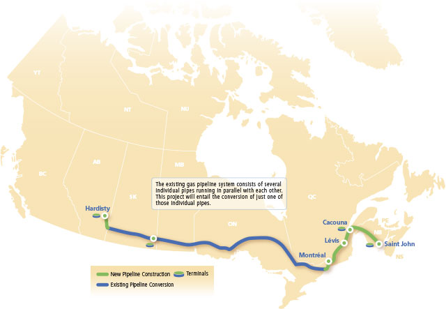
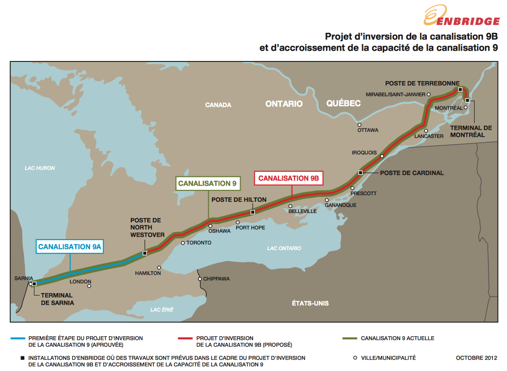

# Pétrole

## L'oéloduc de TransCanada

<table>
  <tr>
    <th>Compagnie</th>
    <td><a href="http://en.wikipedia.org/wiki/TransCanada_Corp.">TransCanada Corporation</a></td>
  </tr>

  <tr>
    <th>Siège social</th>
    <td>Calgary, Alberta</td>
  </tr>

  <tr>
    <th>Nom du projet</th>
    <td><a href="http://www.oleoducenergieest.com">Oléoduc Énergie Est</a></td>
  </tr>
  <tr>
    <th>Débit</th>
    <td>1,1 million barils de pétrole par jour</td>
  </tr>
</table>

* TransCanada projette de construire un oléoduc qui reliera l'Ouest canadien au Nouveau-Brunswick. ([source][3])
* L'oléoduc doit alimenter les deux raffineries du Québec. ([source][3])
* Le pétrole de l'oléoduc pourrait aussi être embarqué sur des bateaux pour exportation. Le port pourrait être bâti à Cacouna. ([source][3])
* L'installation du port à Cacouna est contestée parce qu'une colonie de belugas y vit. Elle pourrait être dérangée par le trafic de bateau. ([source][3])

## L'inversion de l'oléoduc 9B d'Enbridge

<table>
  <tr>
    <th>Compagnie</th>
    <td><a href="http://en.wikipedia.org/wiki/Enbridge">Enbridge</a></td>
  </tr>
  
  <tr>
    <th>Siège social</th>
    <td>Calgary, Alberta</td>
  </tr>

  <tr>
    <th>Nom du projet</th>
    <td><a href="http://www.enbridge.com/ECRAI_FR/Line9BReversalProject_FR.aspx">Inversion de la canalisation 9B (phase 2) et accroissement de la capacité de la canalisation 9</a></td>
  </tr>
  <tr>
    <th>Débit</th>
    <td>300 000 barils de pétrole par jour</td>
  </tr>
</table>

## Informations en vrac

Marco Bélair-Cirino, *Pétrole lourd : Québec aura le dernier mot*, Le Devoir, 12 octobre 2013, C1, http://www.ledevoir.com/economie/actualites-economiques/389860/petrole-lourd-quebec-aura-le-dernier-mot

* Il y a plusieurs types de pétrole (lourd, moyen, léger) et toutes les raffineries ne sont pas équipées pour traiter tous les types de pétrole.
* Énergie Valero exploite plusieurs raffineries en Amérique du Nord. Elle exploite notamment la raffinerie Jean Gaulin à Lévis. Cette raffinerie est approvisionnée par du brut d'Europe, d'Afrique occidentale et d'Amérique du Sud.
* Elle évalue que l'avantage du prx du pétrole de l'ouest canadien serait de l'ordre de 4.80$-6.89$ le baril en 2015 et de 1.79$-3.79$ le baril en 2025. Pour référence, le prix du baril aujourd'hui (2013-11-22) est à 94.84USD/baril (voir http://www.bloomberg.com/energy/)
* Côté canalisation, on parle de l'inversion de la 9B et d'une possible augmentation de la capacité de la canalisation 9.
* L'inversion de 9B amènerait 300 000 barils/jour supplémentaires.
* Suncor et Valéro ont une entente avec Enbridge pour recevoir la majeure aprtie de ces barils.

[3]: http://www.ledevoir.com/environnement/actualites-sur-l-environnement/393601/bas-saint-laurent-un-port-petrolier-pour-le-brut-albertain
